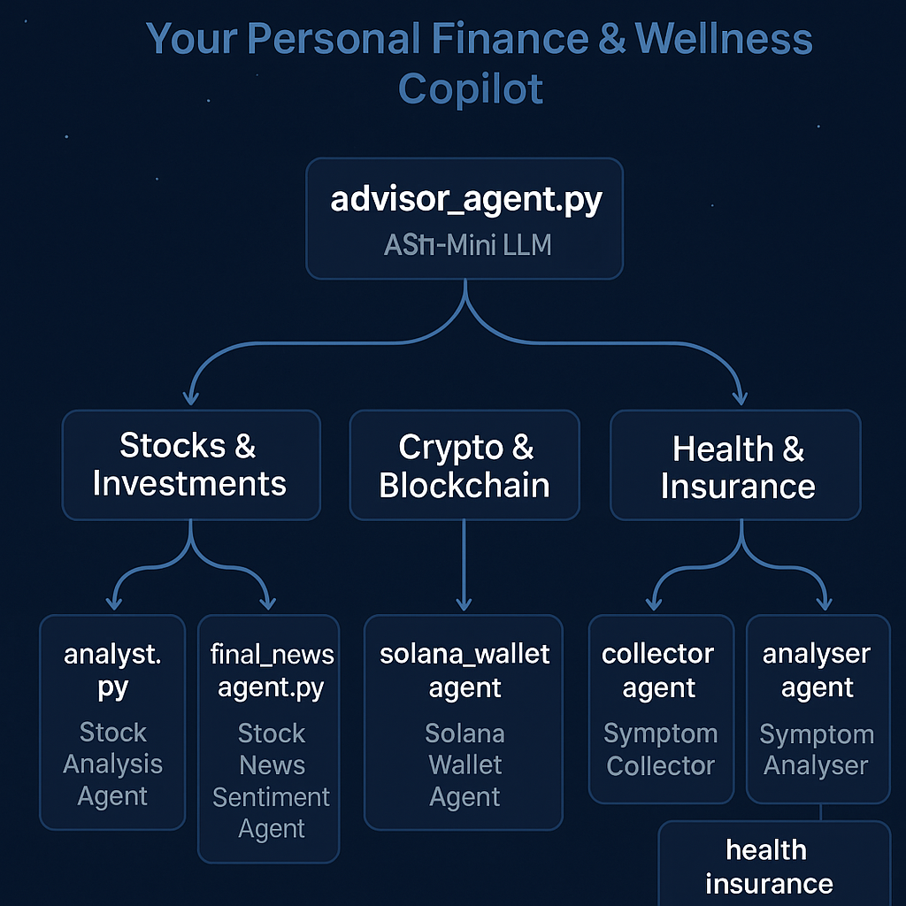

# FinWell: Your Personal Finance & Wellness Copilot Using Fetch.ai



---

## Overview

**FinWell** is a decentralized AI copilot that empowers users to manage their **stock portfolio**, **crypto assets**, and **health insurance decisions**—all through a conversational agent network built using **uAgents**, **ChatProtocol**, and **ASI1 Mini LLM**.

Whether you’re planning investments or understanding insurance eligibility based on your symptoms, FinWell brings it all together—intelligently.

---

## Domains & Agents

| Domain               | Agent File(s)                       | Purpose                                         |
|---------------------|-------------------------------------|-------------------------------------------------|
| Stocks & Equity   | `analyst_agent.py`, `news_agent.py` | Stock research & news sentiment analysis        |
| Crypto & Wallets  | `solana_wallet_agent`, `token-sentiment-tracker` | Solana balance + Crypto market outlook |
| Health & Insurance| `collector_agent.py`, `analyser_agent.py`, `insurance_agent.py`, `asi1_wrapper_agent.py` | Symptom analysis & plan recommendation |
| Central Routing   | `main_cli_agent.py`, `advisor_agent.py` | Routes user queries to relevant agents         |

---

## Project Structure

```
FinWell/
│
├── advisor/
│   └── advisor_agent.py
├── cli/
│   └── main_cli_agent.py
├── crypto/
│   ├── solana_wallet_agent/
│   └── token-sentiment-tracker/
├── health/
│   ├── collector_agent.py
│   ├── analyser_agent.py
│   ├── insurance_agent.py
│   ├── asi1_wrapper_agent.py
│   └── main.py
├── shared/
│   └── chat_model.py
├── stocks/
│   ├── analyst_agent.py
│   └── news_agent.py
└── README.md
```

---

## Setup Instructions

### 1. Clone Repo

```bash
git clone https://github.com/Kavinesh11/FinWell.git
cd FinWell
```

### 2. Create `.env` Files

Place `.env` files in relevant directories, including:

- `GEMINI_KEY` for analyst/news agents
- `ASI_LLM_KEY` for ASI1 wrapper

### 3. Install Dependencies

```bash
pip install -r requirements.txt
```

(Each agent may have its own `requirements.txt`; consolidate as needed)

---

## Run Example Agents

### CLI Agent

```bash
python cli/main_cli_agent.py
```

### Health Stack

```bash
python health/main.py
python health/collector_agent.py
python health/analyser_agent.py
python health/insurance_agent.py
python health/asi1_wrapper_agent.py
```

### Stocks Stack

```bash
python stocks/analyst_agent.py
python stocks/news_agent.py
```

### Crypto Stack

```bash
python crypto/solana_wallet_agent/agent.py
python crypto/token-sentiment-tracker/agent.py
```

---

## AgentVerse Deployment 

You can register agents (e.g., Solana or Token Tracker) to [AgentVerse](https://chat.agentverse.ai/) for public communication.

---

## Project Pitch

> **"FinWell is a decentralized personal finance & wellness agent network that helps users manage stock investments, crypto portfolios, and health coverage through intelligent, autonomous agents. Powered by Fetch.ai’s uAgents framework, ChatProtocol, and ASI1 Mini LLM, it delivers conversational access to expert insights across domains—making your financial and wellness decisions smarter, faster, and fully connected."**

---

## Contributors

- [Pooja Shree S](#)
- [Kavinesh P](#)
- [Swapneel](#)
- [Akshay KS](#) 

---

Let FinWell guide your financial and wellness journey.
