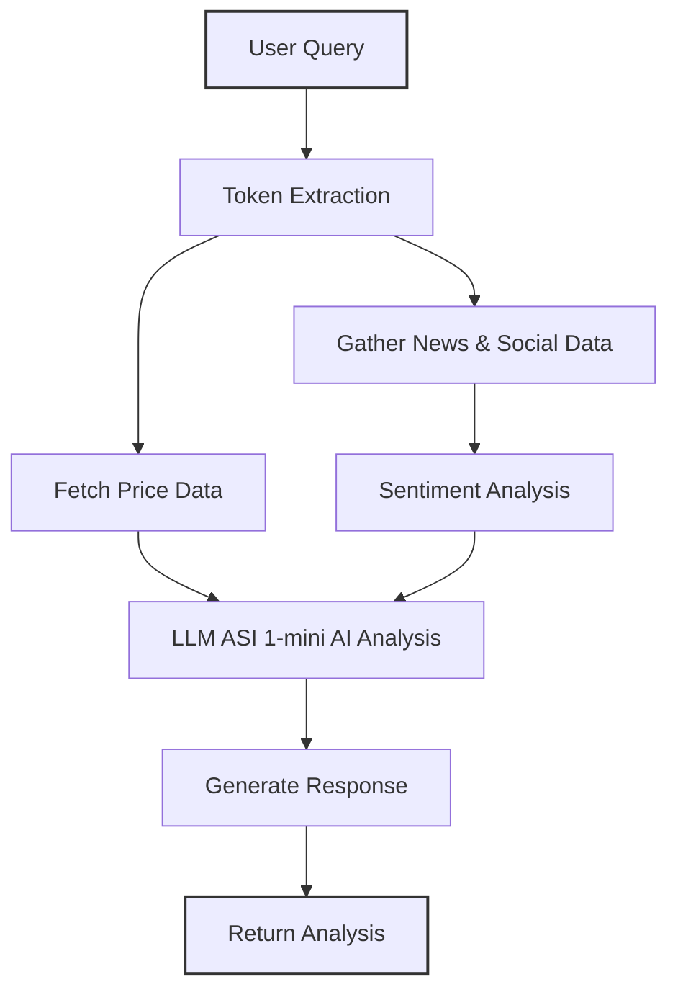

<div align="center">

# Token Sentiment & Price Tracker

[](https://opensource.org/licenses/MIT)


[](https://chat.agentverse.ai)


**Real-time cryptocurrency analysis with sentiment intelligence**

</div>

## Overview

A powerful `uagents`-based agent that provides real-time cryptocurrency market analysis by combining price data from CoinGecko with sentiment analysis from multiple sources. The agent offers both AI-powered insights (using ASI LLM) and rule-based fallback analysis.

<div align="center">
  
  
  
  
  
</div>

## Features

- **Real-time Market Data**
  - Price tracking with 24h, 7d, and 30d trends
  - Market cap and trading volume analysis
  - Multiple cryptocurrency support

- **Sentiment Analysis**
  - News aggregation from top crypto sources
  - Social media sentiment scoring
  - VADER-based sentiment classification

- **AI-Powered Insights**
  - ASI LLM integration for contextual analysis
  - Fallback to rule-based analysis when needed
  - Natural language processing of queries

- **Agentverse Integration**
  - Seamless chat interface
  - Easy deployment and interaction
  - Multi-agent communication ready

## Quick Start

### Prerequisites
- Python 3.8+
- pip (Python package manager)

### Installation

1. **Clone the repository**
   ```bash
   git clone https://github.com/6u5t4v05ouz4/token-sentiment-tracker.git
   cd token-sentiment-tracker
   ```

2. **Set up a virtual environment** (recommended)
   ```bash
   # Windows
   python -m venv venv
   .\venv\Scripts\activate
   
   # macOS/Linux
   python3 -m venv venv
   source venv/bin/activate
   ```

3. **Install dependencies**
   ```bash
   pip install -r requirements.txt
   ```

4. **Configure environment variables**
   ```bash
   cp .env.example .env
   ```
   Edit the `.env` file with your API keys.

## Configuration

Create a `.env` file with the following variables:

```env
# Required for advanced analysis
ASI_LLM_KEY=your_asi_llm_api_key

# Optional (recommended for production)
COINGECKO_API_KEY=your_coingecko_api_key

# Optional: For consistent agent address
AGENT_SEED=your_secret_seed_phrase
```

## Running the Agent

Start the agent with:

```bash
python agent.py
```

Once running, the agent will display its address. Use this address to interact with it on [Agentverse](https://chat.agentverse.ai).

## Example Queries

- "What's the current status of Bitcoin?"
- "Analyze Ethereum market sentiment"
- "How is SOL performing?"
- "Give me a technical analysis of AVAX"

## Sample Output

```
 Bitcoin (BTC) Market Overview

 Price & Market Data
• Current Price: $61,234.56
• Market Cap: $1.2T
• 24h Volume: $42.8B
• 24h Change: -2.34%
• 7d Change: +5.67%
• 30d Change: +12.45%

 Sentiment Analysis
• Score: 0.72/1.0
• Category: Bullish 

 Market Analysis
Bitcoin shows strong momentum with a 12.45% gain over the past month...
```

## Agent Architecture



## Documentation

For detailed documentation, please refer to:
- [uAgents Documentation](https://fetch.ai/docs/)
- [Agentverse Platform](https://agentverse.ai)
- [CoinGecko API](https://www.coingecko.com/en/api/documentation)

## Contributing

Contributions are welcome! Please feel free to submit a Pull Request.

## License

This project is licensed under the MIT License - see the [LICENSE](LICENSE) file for details.

## Disclaimer

This software is for educational and informational purposes only. It should not be considered financial advice. Always conduct your own research before making any investment decisions.

---

<div align="center">
  Made with ❤️ using <a href="https://fetch.ai/" target="_blank">uAgents</a> and <a href="https://agentverse.ai" target="_blank">Agentverse</a>
</div>

## Usage

### Running the Agent

Execute the agent script from your terminal:

```bash
python agent.py
```

Upon startup, the agent will display its address. This address is needed to interact with the agent on Agentverse.

### Interacting with the Agent on Agentverse

1.  Ensure your agent is running locally.
2.  Go to [https://chat.agentverse.ai](https://chat.agentverse.ai).
3.  Search for your agent using the address logged in your terminal (e.g., `agent1q...`).
4.  Once found, you can start a chat and ask for token analysis.

**Example queries:**
*   "What's the outlook for BTC?"
*   "How is Ethereum doing?"
*   "Tell me about LINK"
*   "Analyze Solana"

## Workflow

1.  A user sends a message to the agent (e.g., "What is the outlook for BTC?").
2.  The agent extracts the cryptocurrency token symbol (e.g., "BTC") from the message.
3.  It fetches real-time price data from the CoinGecko API.
4.  It gathers recent news and market data related to the token from various sources (CoinGecko, CryptoCompare).
5.  The collected texts are analyzed for sentiment using NLTK/VADER.
6.  If the `ASI_LLM_KEY` is configured and valid, the price data and sentiment analysis are sent to the ASI LLM for a comprehensive, contextual outlook.
7.  If the ASI LLM is unavailable or the key is not set, a fallback analysis is generated based on predefined rules and the collected data.
8.  The agent formats the information into a structured response.
9.  The complete analysis is sent back to the user via the chat protocol.

## ASI LLM Integration

This agent can use the ASI LLM (`asi1-mini` model) to provide richer and more contextual analyses by:

-   Synthesizing price data and market sentiment into coherent insights.
-   Identifying potential correlations between different market indicators.
-   Generating natural language market outlooks.

### Automatic Fallback

If the ASI LLM API is unavailable (e.g., network issues, invalid key, API downtime), the agent automatically switches to a rule-based fallback system. This system uses the same price and sentiment data but applies predefined logic to generate the analysis, ensuring the user still receives a helpful response.

## Troubleshooting

-   **Agent not found on Agentverse:**
    *   Allow a few minutes for the agent to register after startup.
    *   Ensure your agent is running and connected to the internet.
    *   Check the agent logs for any error messages related to Almanac registration or mailbox connection.
-   **No advanced LLM analysis:**
    *   Verify that the `ASI_LLM_KEY` is correctly set in your `.env` file and is valid.
    *   Check your internet connection, as the agent needs to reach the ASI LLM API.
    *   Look for any API error messages from ASI LLM in the agent's logs.
-   **Errors fetching data:**
    *   Ensure `COINGECKO_API_KEY` is valid if you're using one.
    *   Public APIs might have rate limits; wait a bit if you encounter temporary errors.

## Example Response

The agent's response will be structured similarly to this:

```
📊 **Bitcoin (BTC)**

💰 **Current Price**: $60000.0000
📈 **24h Change**: 1.50%
📊 **24h Volume**: $30,000,000,000
🏆 **Market Cap**: $1,200,000,000,000

😀 **Sentiment**: Bullish (score: 0.35)
📰 **Sources**: CoinGecko, CryptoCompare News [or other sources used]

✨ **Analysis**:
[This section will contain the detailed analysis generated either by the ASI LLM or the fallback system. It will include a summary, key factors, short-term outlook, and points to watch.]

⏱️ *Last updated: YYYY-MM-DD HH:MM:SS UTC*
```

## Dependencies

The core dependencies for this agent are:

-   `uagents`: The framework for building decentralized agents.
-   `python-dotenv`: For managing environment variables.
-   `nltk`: For Natural Language Processing, specifically sentiment analysis with VADER.
-   `requests`: For making HTTP requests to external APIs.

These should be listed in your `requirements.txt` file.

## License

This project is licensed under the MIT License. See the `LICENSE` file for details (if one is present in your project).

## Disclaimer

This agent provides information for educational and informational purposes only. The analysis should not be considered financial advice. Always conduct your own research (DYOR) before making any investment decisions.


## Contact

For any questions or inquiries, feel free to reach out:

- **Email**: [gustavo.asouza@live.com](mailto:gustavo.asouza@live.com)
- **WhatsApp**: [+55 12 99637-3190](https://wa.me/5512996373190)
- **Twitter**: [@0x6u5t4v05ouz4](https://twitter.com/0x6u5t4v05ouz4)


```

